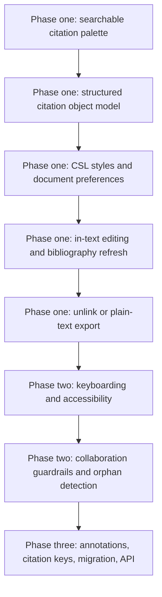

# Reference Manager Word Processor Plugins

## Executive Summary

This review points to a clear split in the market. Zotero has the most transparent, best-documented, and most feature-complete word-processor integration stack among the major reference managers reviewed here. Its Word, LibreOffice, and Google Docs integrations are all first-party, its document model is explicit about fields versus bookmarks, its citation editing model is rich, and its developer-facing protocols are unusually well documented. Mendeley Cite, by contrast, presents a cleaner and more modern Word add-in surface, but the current public documentation is narrower: it clearly documents Word support and the core cite-edit-refresh-style workflow, while exposing much less detail about document internals, automation, keyboarding, collaboration safety, and offline behavior. citeturn11search0turn41view0turn8search12turn17search0turn36search4turn28view0

For Callosum, assuming the current baseline is only basic citation insertion and bibliography generation, the highest-value missing layer is not "more integrations" first. It is a robust structured citation model: searchable citation insertion, in-text citation editing, CSL-driven style selection, bibliography refresh, document preferences, and safe conversion to plain text at submission time. That is the minimum threshold to feel competitive with Zotero, EndNote, Paperpile, RefWorks, and other mature tools. Word support is table stakes. Google Docs support matters for competitive parity, but only after the structured document model is stable. LibreOffice and Overleaf/LaTeX are real differentiators for a smaller subset of users, but they are not the first scope boundary to cross if Callosum is resource constrained. citeturn41view0turn35view0turn18search12turn18search1turn19search12turn20search5

A practical scoping conclusion follows from the docs. Zotero's strongest ideas to copy are not cosmetic. They are architectural: document-local preferences, a citation object that can be reopened and edited, refresh semantics, explicit unlink/export semantics, keyboardable search, and cautious handling of coauthor edits and orphaned citations. Mendeley's strongest ideas to copy are its right-pane workflow, low-friction insert/edit cycle, and simple bibliography and refresh affordances. If Callosum must stay limited, the best strategy is "Zotero-like internals, Mendeley-like surface simplicity." citeturn41view0turn35view0turn36search2turn36search6turn36search7turn36search0

One scope caveat matters. Across several commercial tools, public docs are much thinner than Zotero's. In the tables below, "not documented in current public docs" means exactly that. It does not prove the feature is absent. It does mean the feature is not part of the vendor's clear public contract in the way Zotero's is. citeturn16search5turn28view0turn20search3turn21search2

## Competitive Landscape

The market has converged on Microsoft Word as the primary authoring target. Google Docs support is now common among Zotero, EndNote, Paperpile, RefWorks, ReadCube Papers, and Sciwheel. LibreOffice remains relatively underserved, with Zotero and JabRef standing out. Overleaf/LaTeX support is usually indirect: export, BibTeX workflows, or editor push integrations, rather than a live cite-as-you-write plugin inside Overleaf itself. citeturn11search0turn18search18turn19search5turn20search14turn23search10turn26search0turn25search0turn25search8

**Legend:**
**Native** = current first-party live integration
**Indirect** = export, copy/paste, or external workflow rather than a live plugin
**Not documented** = I did not find a current first-party public doc for that route

| Product | Microsoft Word | Google Docs | LibreOffice | Overleaf or LaTeX | Notes | Sources |
|---|---|---:|---:|---:|---|---|
| Zotero | Native | Native | Native | Indirect | First-party plugins for Word, Google Docs, LibreOffice. LaTeX is usually handled through BibTeX ecosystem workflows and add-ons rather than the word-processor plugin. | citeturn11search0turn8search12turn8search6turn13search2turn14search0 |
| Mendeley | Native | Not documented | Not documented | Not documented | Current public product pages document Mendeley Cite for Word only. | citeturn17search0turn17search11turn36search2turn16search5 |
| EndNote | Native | Native | Not documented | Indirect | Current docs explicitly cover Word, Word Online, and Google Docs. BibTeX export exists as an output style. | citeturn18search12turn18search9turn18search1turn18search2 |
| Paperpile | Native | Native | Not documented | Native | Word plugin is still labeled beta. Help center explicitly documents Google Docs, LaTeX/BibTeX, and Overleaf routes. | citeturn19search2turn19search1turn19search3turn19search5 |
| RefWorks | Native | Native | Not documented | Indirect | RefWorks Citation Manager now covers Word and Google Docs. BibTeX and BibLaTeX export paths exist in RefWorks. | citeturn20search5turn20search0turn39search6turn39search15 |
| Citavi | Native | Indirect | Not documented | Indirect | Citavi works directly with Word. Its current product pages position Google Docs as copy-paste and cite LaTeX support as a separate path. | citeturn21search2turn39search2 |
| ReadCube Papers | Native | Native | Not documented | Not documented | SmartCite is officially documented for Word and Google Docs. | citeturn23search2turn23search12turn23search10 |
| Sciwheel | Native | Native | Not documented | Not documented | Current public site markets Word and Google Docs add-ons and shared projects. | citeturn26search0 |
| JabRef | Indirect | Not documented | Native | Native | Live integration is strongest for LibreOffice and LaTeX editors. Word is an export/import workflow, not a live plugin. | citeturn25search0turn25search3turn25search8turn25search9 |
| BibDesk | No current doc found | No current doc found | No current doc found | Native | BibDesk remains LaTeX-centric rather than word-processor-centric. | citeturn24search2 |

A second comparison, limited to publicly documented competitive differentiators, is more useful for scoping than a long support grid.

| Product | Dynamic cite and bibliography | Shared library collaboration | PDF annotation to writing workflow | Published automation surface | Notes | Sources |
|---|---|---:|---:|---:|---|---|
| Zotero | Yes | Yes | Yes | Strong | Best-documented full stack, including integration protocols and APIs. | citeturn41view0turn35view0turn33view0turn32view2turn29view0turn30view0 |
| Mendeley | Yes | Yes | Partial | Medium | Good core writing flow, but fewer published details for document internals or plugin automation. | citeturn36search4turn36search6turn36search5turn37search4turn28view0 |
| EndNote | Yes | Yes | Less central in docs | Medium | Strong writing integrations and Google Docs support. | citeturn18search12turn18search1turn18search18turn18search3 |
| Paperpile | Yes | Yes | Via library and PDF tooling | Medium | Especially strong on Google Docs and LaTeX/Overleaf workflows. | citeturn19search1turn19search12turn19search3turn19search7 |
| RefWorks | Yes | Yes | Increasing | Medium | Word and Google Docs path is now clearly first-party. | citeturn20search14turn20search7turn39search6 |
| Citavi | Yes | Yes | Strong in knowledge workflow | Low public detail | Differentiates through outline, quotations, and knowledge management in Word. | citeturn21search0turn21search2 |
| ReadCube Papers | Yes | Yes | Yes | Low public detail | SmartCite emphasizes team authoring and style breadth. | citeturn23search2turn23search4turn23search16 |
| Sciwheel | Yes | Yes | Yes | Low public detail | Shared projects plus Word and Google Docs are the main documented story. | citeturn26search0turn26search1 |

## Zotero Plugin Functionality

Zotero's plugin functionality is unusually explicit and mature. In Word, the Zotero tab exposes Add/Edit Citation, Add/Edit Bibliography, Document Preferences, Refresh, and Unlink Citations. That alone already indicates the real abstraction level: Zotero is not merely inserting formatted text. It is maintaining structured citation objects inside the document, exposing a refresh cycle, and allowing irreversible conversion to plain text when the document is finalized. citeturn41view0

The citation insertion flow is fast-search-first. Clicking Add/Edit Citation opens the quick-format citation dialog. Users can search by title, author surname, or year. Matches appear instantly, grouped across My Library and group libraries, with previously cited items surfaced at the top under "Cited." The selected item becomes a token or "bubble" in the dialog, and a second Enter inserts the citation. That search design is good scoping evidence for Callosum: the critical unit is not a static picker, but a keyboard-forward citation palette that ranks current-document context and cross-library relevance. citeturn41view0turn35view0

Zotero's in-text editing functionality is broad and well documented. Existing citations can be reopened and edited. The cite options UI supports locator types, page ranges, prefix, suffix, rich-text affixes with HTML tags for italics, bold, subscript, and superscript, omit author for narrative citations, multiple works inside one citation, manual reordering, and toggling automatic sort order. Users can switch from the quick-format interface to a classic collection-browser dialog. This is the strongest example in the market of what "basic insert citation" grows into when it becomes an actual writing tool. citeturn41view0turn9view3

Bibliography generation is equally structured. Add/Edit Bibliography inserts a bibliography at the cursor location, and Zotero automatically updates it as citations change. The bibliography editor can add uncited sources or remove cited sources from the final list, but Zotero explicitly warns that manual formatting edits there are fragile and will not keep syncing from the library. The design principle is good: treat bibliography editing as a structured exception workflow, not the primary editing surface. citeturn41view0turn35view0

Zotero's style and document settings are also richer than many competitors' public docs suggest. Document Preferences covers citation style, citation language, note-style destination for note-based styles, Fields versus Bookmarks storage, journal abbreviation behavior, and in Google Docs the option to delay automatic citation updates for performance, with visual gray-background cues for "not final yet" citations. CSL is first-class. Zotero ships with popular styles, links to more than 10,000 additional styles in its repository, supports local `.csl` installation, and includes a style editor and preview tools. citeturn41view0turn10view3turn34view0turn34view1

Collaboration and syncing are also part of the plugin story. Zotero stores data locally by default and makes syncing optional, which implies Word and LibreOffice workflows can remain local-first while sync is layered on top. Data sync merges items, notes, tags, and links across devices, while file sync handles PDFs and attachments. If the same item changes in conflicting ways before sync, Zotero surfaces a conflict-resolution dialog. Group libraries support separate permissions for reading, editing, and file editing, and Google Docs collaboration has explicit guardrails: collaborators should have the connector installed, and simultaneous citation editing is discouraged because Zotero's anti-corruption mechanisms are helpful but not "perfect safety." citeturn32view0turn33view0turn10view3

Zotero also has a notable bridge from PDF reading to writing. Annotations added to notes automatically include links back to the PDF page and citations that can later be inserted into Word, LibreOffice, or Google Docs with the word-processor plugins. That is not quite "insert annotation directly into Word," but it is a real write-through path from evidence capture to manuscript authoring. For Callosum, this is a good example of a nice-to-have feature that visibly differentiates power-user workflows without complicating the core citation object model. citeturn32view2

One area where Zotero is weaker in core and stronger in ecosystem is citation keys. Current core plugin docs do not position citation keys as a native word-processor feature. In practice, Zotero users often rely on the Better BibTeX add-on to generate stable citation keys, support LaTeX workflows, and add citekey-based automation. Because Better BibTeX is a third-party add-on rather than the core word-processor plugin, this should count as ecosystem capability, not core competitor parity. citeturn13search2turn14search0turn14search2

On keyboarding and accessibility, Zotero is significantly better documented than its competitors. In Word and Google Docs, users get shortcutable toolbar actions, arrow-key selection in search results, inline page entry such as `p.45-48`, `ibid` selection, and keyboard opening of the cite-options dialog. Google Docs additionally documents a configurable shortcut for inserting citations. That matters for advanced users and for accessibility reviews. citeturn41view0turn9view1

Finally, Zotero is far ahead on automation and plugin architecture. The Google Docs plugin is documented as a simple HTTP citing protocol over local endpoints, including explicit commands like `addEditCitation`, `addEditBibliography`, `refresh`, `removeCodes`, `setDocPrefs`, and `exportDocument`. The LibreOffice integration is documented through a wire protocol. Zotero also publishes a Web API, a Local API, and client libraries. This is not just developer nicety. It lowers long-run integration risk and makes behavior observable, testable, and scriptable. citeturn29view0turn29view1turn30view0

A compact inventory is below.

| Capability | Zotero status | Evidence and scoping implication |
|---|---|---|
| Citation insertion | Native | Quick-format search dialog with library and cited-item ranking. Good model for Callosum's base UI. citeturn41view0 |
| Bibliography generation | Native | Auto-updating bibliography plus edit window for edge cases. citeturn41view0turn35view0 |
| In-text editing | Native | Locators, page ranges, prefix, suffix, omit author, multiple sources, sort control. citeturn41view0turn9view3 |
| Citation styles | Native | CSL repository, local style install, style editor, style preview, style language. citeturn34view0turn34view1 |
| Document preferences | Native | Style, language, fields/bookmarks, journal abbreviations, note/endnote behavior, delayed updates in Docs. citeturn41view0turn10view3 |
| Field codes and plain-text export | Native | Fields or bookmarks, refresh, unlink, switch word processors. citeturn41view0turn9view2 |
| Collaboration | Native | Group libraries plus explicit Google Docs collaboration warnings and permissions. citeturn33view0turn10view3 |
| Sync and conflict resolution | Native | Local-first storage, optional sync, conflict dialog, file sync. citeturn32view0 |
| Metadata lookup | Native | Retrieve PDF metadata from PDFs and DOI/ISBN-based recovery paths. citeturn33view1 |
| PDF annotation linkage | Native | Annotation-to-note workflow preserves PDF links and future cite insertion. citeturn32view2 |
| Citation key management | Ecosystem, not core | Better BibTeX provides stable citekeys for LaTeX workflows. citeturn14search0turn14search2 |
| Keyboard shortcuts | Native | Extensive documented keyboarding, including Docs shortcut and dialog navigation. citeturn41view0turn9view1 |
| API and automation | Native and strong | Public citing protocols and Web API. citeturn29view0turn29view1turn30view0 |

## Mendeley Plugin Functionality

The current Mendeley story is centered on **Mendeley Cite**, a Microsoft Word add-in rather than a traditional desktop Word plugin. Official pages describe compatibility with Microsoft 365, Word 2016 and later, Word on iPad, and Word on the web. Public docs do not document current first-party Google Docs or LibreOffice writing integrations for Mendeley Cite. That makes Mendeley narrower than Zotero on published platform coverage, even if the writing UI is simpler. citeturn17search0turn17search11turn36search2

The documented writing flow is right-pane-first. Once installed, Mendeley Cite is accessed from the References tab in Word. The add-in opens in a task pane on the right. On the References tab, users search the library, check one or more references, and insert the citation. This is a notably lower-friction visual model than Zotero's modal quick-format bar. It is easier to understand for novice users, but it is also slower and more mouse-dependent unless the implementation is unusually polished. That tradeoff matters for Callosum UI design. The official guide pages and public screenshots make this interaction model very clear. citeturn36search2turn36search6turn40image1

Mendeley Cite supports editing citations after insertion. The guide flow is to select an existing citation, reopen it from the add-in, and then edit the reference list in that citation. The current public guide set also documents manual override of a citation and full refresh of references. Refresh updates references and the bibliography based on the selected style. In other words, Mendeley does expose the same core lifecycle as Zotero at a high level: insert, edit, refresh, and bibliography. What it does not publicly expose to the same depth is the underlying document model. citeturn36search7turn36search3turn36search0

Bibliography generation is built in and mostly automatic. Mendeley's guide states that citations and bibliography are styled together according to the selected citation style, and that the bibliography automatically reorders as needed. Public screenshots also show bibliography insertion under the add-in's menu path. This is competitive parity on the visible writing flow, even if the error handling and internals are not as well documented as Zotero's. citeturn36search5turn40image3

Style handling is solid but more opaque than Zotero's public story. Mendeley documents choosing citation style and citation language, and says that when users first open the add-in, APA is selected and the tab displays the top 10 most common styles. The broader Mendeley guides hub also includes a CSL Editor, which indicates that Mendeley still lives in the CSL ecosystem. The consequence for Callosum is straightforward: style breadth matters, but what matters more is how discoverable style switching is from inside the manuscript workflow. Mendeley gets credit there. citeturn36search1turn16search5

Mendeley's collaboration model is primarily library-level rather than document-model-level in current public docs. Feature pages emphasize groups, shared libraries, shared references, and collaborative PDF annotation. The broader Reference Manager guide also explicitly says users can collaborate with others by sharing references and annotations. That is valuable, but it is different from documenting safe concurrent citation editing in a live document. I did not find current first-party public documentation comparable to Zotero's connector-required warnings, orphaned citation behavior, or concurrent Google Docs edit cautions. For scoping, this suggests Mendeley's public contract prioritizes "shared corpus" over "document-state safety." citeturn37search4turn37search11turn37search21

Mendeley's metadata and PDF tooling sit mostly outside the Cite add-in itself but still affect the completeness of the writing workflow. Mendeley markets watched folders, PDF importing, the Web Importer, synchronization, and PDF reading and annotation. The homepage and features pages also emphasize cloud sync and 2 GB of free storage. Those are inputs to the add-in's search and insertion experience, even if they are not exposed as plugin buttons in Word. citeturn16search4turn38search14turn37search8

The biggest documentation gap appears around advanced or technical behavior. In the current public docs I reviewed, I did not find first-party documentation for citation key management, visible field-code or structured-document storage choices, plugin-level keyboard shortcuts, explicit offline authoring behavior, or a Mendeley Cite-specific automation API. Mendeley does publish developer APIs for library and data access, but the developer portal is a general Mendeley API portal rather than a plugin automation surface analogous to Zotero's citing protocols. That means Mendeley is viable as a polished user-facing benchmark, but a poor benchmark if Callosum wants a transparent, scriptable plugin stack. citeturn28view0turn16search5turn36search4

A compact inventory is below.

| Capability | Mendeley status | Evidence and scoping implication |
|---|---|---|
| Citation insertion | Native | Right-pane insert flow from the References tab in Word. Simple and learnable. citeturn36search2turn36search6turn40image1 |
| Bibliography generation | Native | Styled with citations and automatically reordered. citeturn36search5turn40image3 |
| In-text editing | Native | Existing citations can be selected and edited; manual override is documented. citeturn36search7turn36search3 |
| Citation styles | Native | Citation style and citation language selection are documented; CSL Editor exists in the guide hub. citeturn36search1turn16search5 |
| Plugin settings | Partial public detail | Public docs clearly expose style, refresh, and bibliography actions, but not a deep document-preferences model like Zotero's. citeturn36search0turn36search1turn40image3 |
| Collaboration | Library-level native | Shared libraries, groups, references, and annotations are documented; document-state conflict controls are not. citeturn37search4turn37search11turn37search21 |
| Sync | Native | Product pages emphasize cloud sync and storage. citeturn37search8 |
| Metadata lookup | Native at library layer | Web Importer and watched folders feed the library used by the add-in. citeturn16search4turn38search14 |
| PDF annotation linkage | Partial | PDF reading and annotation are documented, but a Zotero-style annotation-to-citation insert path is not clearly documented. citeturn16search4turn37search4 |
| Citation key management | Not documented | No current first-party citekey feature found in reviewed Mendeley Cite docs. citeturn16search5turn36search4 |
| Field codes or content storage model | Not documented | Public docs cover workflow, not document internals. citeturn36search4turn17search0 |
| Keyboard shortcuts | Not documented | I did not find current first-party shortcut docs comparable to Zotero's. citeturn16search5turn36search4 |
| Offline behavior | Not documented | Current public docs do not clearly explain offline Cite behavior. citeturn17search0turn36search4 |
| API and automation | Medium, but not plugin-specific | Mendeley Developer Portal exists, but not as a documented Cite transaction protocol. citeturn28view0 |

## UX Patterns and Gaps for Callosum

The two products embody different UX philosophies. Zotero is **modal, fast, and structurally explicit**. Mendeley is **pane-based, visually straightforward, and behaviorally narrower in public docs**. That distinction is visible in their key dialogs and screenshots. Zotero's Word and Google Docs docs show a quick-format citation bar, a citation-options popover, Document Preferences, and a bibliography editor. Mendeley's public guide pages show a persistent right sidebar, a References tab for insertion, a style tab, a refresh step, and a More menu path for bibliography insertion. This report cannot embed all of those vendor images inline without clutter, but the cited guide pages and screenshot sources in this section are the relevant visual artifacts to review during scoping. citeturn41view0turn35view0turn40image1turn40image3

A useful flow comparison is:

- **Zotero flow**: open citation dialog -> type search query -> choose one or more library items -> optionally open cite options for locator, affixes, omit author, sort control -> insert citation -> refresh if needed -> bibliography updates automatically -> unlink only when producing a final plain-text copy. citeturn41view0turn35view0
- **Mendeley flow**: open Word task pane from References tab -> search and check references in sidebar -> insert citation -> reopen selected citation for edits or manual override -> use style tab and refresh -> insert or update bibliography from the add-in controls. citeturn36search2turn36search6turn36search7turn36search0turn40image1turn40image3

The biggest gap between mature competitors and an assumed minimal Callosum plugin is not bibliography generation. It is **reopenable citation structure**. Mature tools treat a citation as an editable object with attributes, not as formatted text. Once that exists, everything else becomes possible: page locators, narrative citations, multi-source clusters, style changes, refresh, safe bibliography rebuilding, conflict warnings, and final plain-text export. Without that object model, the plugin can only fake maturity. Zotero's explicit fields/bookmarks model is the clearest example of this. citeturn41view0turn29view0

A second gap is **document-local settings**. Both Zotero and Mendeley keep style choice within the manuscript workflow, but Zotero goes much further by making document preferences explicit and durable. That is exactly what users need when a paper is passed between coauthors or moved between processors. A minimal plugin that stores only "current global user style" will feel brittle immediately. citeturn41view0turn10view3turn36search1

A third gap is **collaboration hygiene**. This is where many plugin efforts fail. Zotero's docs repeatedly acknowledge citation unlinking, orphaned references, connector requirements, and concurrent-edit risks. Those warnings are not cosmetic. They reveal that real-world coauthoring breaks naive implementations. If Callosum implements only insert and generate-bibliography, but not orphan detection, refresh validation, or export-to-plain-text safeguards, it will appear unreliable compared with established tools. citeturn10view3turn12search7turn35view0

A final gap is **automation surface**. Even if Callosum does not expose a public API in version one, designing the internals so a citation insertion, refresh, or unlink action can later be called programmatically is strategically smart. Zotero's public integration protocol shows how valuable it is when plugin behavior is command-based rather than UI-hardcoded. citeturn29view0turn29view1

## Recommended Scope and Test Plan

The recommended scoping principle is simple: implement the smallest set of features that converts Callosum from a "formatted text inserter" into a "structured citation editor." That is the threshold where users stop treating the plugin as fragile. The table below prioritizes features accordingly. Complexity is estimated relative to a typical Claude Code implementation effort for a limited plugin surface, assuming existing library and bibliography generation already exist.

| Priority | Feature | Why it matters | Complexity | Impact |
|---|---|---|---|---|
| Must-have | Searchable citation palette | This is the front door. Zotero and Mendeley both make search the primary primitive. It must search title, author, year, and ideally prioritize already-cited items. | Medium | Very high |
| Must-have | Structured citation object model | Required for reopen/edit behavior, style changes, refresh, and safe bibliography regeneration. Use hidden structured metadata, not plain text. | High | Very high |
| Must-have | In-text citation editing | Support page locators, prefix, suffix, omit author, and multi-source clusters. This is where mature tools separate from toy plugins. | High | Very high |
| Must-have | CSL style engine plus document-local style preference | Users need style switching per document, not only per account. Use CSL from the start. | Medium | Very high |
| Must-have | Refresh and bibliography rebuild | Refresh should validate all structured citations and rebuild the bibliography deterministically after metadata or style changes. | Medium | Very high |
| Must-have | Unlink or export-as-plain-text flow | Users need a final-submission mode that freezes the document and avoids later corruption. | Medium | High |
| Nice-to-have | Keyboard shortcuts and accessible navigation | Zotero's docs show these are valued by serious users and required for accessibility maturity. | Medium | High |
| Nice-to-have | Collaboration guardrails | Detect concurrent edits, orphaned citations, missing-library items, and invalid structured data. Warn clearly. | High | High |
| Nice-to-have | Citation search ranking with current-document context | Surface cited items first and improve ranking. This is a UX multiplier, not just polish. | Medium | Medium to high |
| Nice-to-have | PDF-annotation-to-citation shortcut | Valuable differentiator for evidence-heavy workflows. | High | Medium |
| Optional | Word-processor conversion or migration tooling | Useful later for moving documents or reading legacy citations, but not core for version one. | High | Medium |
| Optional | Citation key management and LaTeX export | Important for Overleaf and technical-writing users, but a separate workflow from core word plugins. | Medium | Medium |
| Optional | Public automation hooks | Strategically valuable, but can wait until behavior stabilizes. | High | Medium |

The most efficient roadmap is below.

The reasoning for this order is that phases one and two replicate the strongest user-facing advantages documented in Zotero and the clearest workflow affordances documented in Mendeley, while leaving ecosystem and power-user features for later. citeturn41view0turn35view0turn36search2turn36search6turn36search0

The test plan should follow the same priority order.

| Recommended feature | Suggested test cases | Acceptance criteria |
|---|---|---|
| Searchable citation palette | Search by exact title, partial title, first author surname, multiple-author surname combination, year only, and mixed query. Search in a large library and in a document with already-cited items. | Relevant results appear within an acceptable latency budget. Exact matches rank above partials. Already-cited items are visually identifiable and can be reselected without duplication bugs. |
| Structured citation object model | Insert citation, save, reopen document, edit citation, change style, refresh bibliography, duplicate paragraph, copy/paste citation, export plain text. | Citations remain editable after reopen. Style changes re-render without data loss. Copy/paste does not silently flatten structured citations. Plain-text export is explicit and irreversible in the exported copy only. |
| In-text citation editing | Add locator, change locator type, add prefix and suffix, toggle omit author, create multi-source cluster, reorder cluster, reopen and modify all of the above. | Every edit is preserved after save and reopen. Re-render is deterministic across refreshes. Narrative and parenthetical citation outputs match style rules. |
| CSL styles plus document-local preference | Open two documents with different styles. Change one document to APA and the other to Chicago note style. Verify document handoff to another machine or user account. | Style choice is stored with the document, not just the user. Refresh preserves per-document settings. Supported style set is discoverable and searchable. |
| Refresh and bibliography rebuild | Edit item metadata in the backing library. Refresh. Delete one citation. Add another. Change style. Trigger bibliography update. | Bibliography always reflects current structured citations and current metadata. Deleted citations disappear from bibliography. Refresh reports invalid or missing citations clearly. |
| Unlink or plain-text export | Create active document, duplicate it, unlink in copy, then attempt refresh or edit in both original and copy. | Original remains fully editable. Unlinked copy contains plain text only and no longer exposes plugin editing affordances. User sees an explicit warning before unlinking. |
| Keyboard shortcuts and accessibility | Full citation insertion without mouse, screen-reader navigation through search results, open cite options from keyboard, operate bibliography insertion and refresh from keyboard. | Core citation workflow is keyboard-complete. Focus management is predictable. Controls expose accessible labels. |
| Collaboration guardrails | Two editors open same document. One edits citation A while another edits citation B. Simulate missing library item, orphaned citation, and malformed citation object. | Plugin prevents silent corruption, surfaces actionable warnings, and never produces a silently stale bibliography. Orphaned citations are detectable and recoverable or clearly flagged. |
| Citation search ranking with document context | Insert 50 citations, then search for an already-cited work and a never-cited work with similar metadata. | Already-cited items can be detected and optionally ranked higher without suppressing correct uncited results. |
| PDF-annotation-to-citation shortcut | Create annotations, convert them to note fragments, insert citation from annotation-derived content. | Citation insertion preserves source identity and, if supported, a backlink or page reference. |
| Citation key management and LaTeX export | Generate stable keys, rename metadata fields, re-export, verify key stability, use exported `.bib` in Overleaf. | Keys remain stable unless explicitly regenerated. Export is reproducible and diff-friendly. |
| Public automation hooks | Script insert-citation, refresh, and style-change actions through a test harness. | Core actions are callable via internal commands or a public API without fragile UI automation. |

A final recommendation is architectural rather than functional. Treat every user-visible citation as a canonical structured payload plus a rendered view. Do not let freehand text editing be the primary editing path. If a user overrides rendered text manually, warn them that automatic updates may be suspended for that citation, mirroring Zotero's documented behavior. That single design choice will prevent a large class of downstream bugs. citeturn41view0turn12search7
