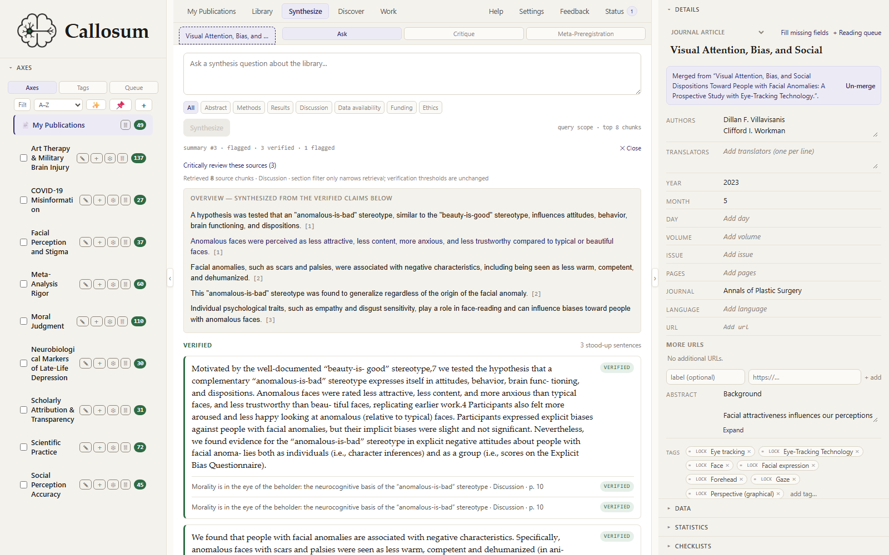

# Callosum

[](https://github.com/cliffworkman/callosum/actions/workflows/ci.yml)
[](https://www.gnu.org/licenses/agpl-3.0)

**Callosum is a local-first scholarly research environment that keeps literature, evidence, methods,
manuscripts, and scientific provenance connected throughout the research and writing process.** Reference
managers organize sources. Callosum manages the relationship between a scholar's sources, evidence, claims,
methods, and manuscript—from discovery through reading, evaluation, synthesis, writing, and audit.

It began with one complaint: I got tired of reading an AI-generated summary of a paper and having no fast way
to check whether it actually said what the summary claimed. So Callosum independently verifies every generated
citation against the source. It now carries that same inspectable-evidence posture through the literature
library, statistical and reporting checks, structured extraction, active manuscripts, document-editor
integrations, and final audits. You get to see the signal. It never hands you a verdict.

It runs on your machine. After import it works **offline**, and nothing leaves your computer unless you
explicitly turn on an AI feature.

> **Status:** a working MVP, pre-1.0, and still visibly under construction. I use it every day for my own
> research, and it's backed by a large test suite — but it's built for one user at a time (me, so far), and the
> surface is still moving fast. You will find rough edges. Tell me about them.



*See more of the app: [a full screenshot tour](www/showcase.html) · [the project page](www/index.html) ·
[how the static interactive demo is built](demo/README.md).*

## Download

No Python, no command line — grab the installer for your platform (also on the
[latest release](https://github.com/cliffworkman/callosum/releases/latest) page):

| Platform | Installer |
|---|---|
| Windows | [Download `.exe`](https://github.com/cliffworkman/callosum/releases/latest/download/Callosum-windows-x64-setup.exe) (NSIS installer) |
| macOS (Apple Silicon) | [Download `.dmg`](https://github.com/cliffworkman/callosum/releases/latest/download/Callosum-macos-arm64.dmg) — Intel Macs aren't supported yet |
| Linux | [Download `.deb`](https://github.com/cliffworkman/callosum/releases/latest/download/Callosum-linux-amd64.deb) (Debian/Ubuntu and derivatives) |

These builds are **unsigned** (no paid Apple/Microsoft developer certificate yet), so your OS will show
a one-time trust warning on first launch — that's expected, not a red flag. See
[`FIRST-LAUNCH-NOTE.md`](app/desktop-shell/FIRST-LAUNCH-NOTE.md) for exactly what you'll see and what to
click.

Prefer to run from source, want a platform not listed above, or planning to contribute? See
**Build from source** below.

## What it does today

**Library & metadata**
- Import from Zotero (metadata + available PDFs), or from **BibTeX / RIS / CSL-JSON** (also covers Mendeley/EndNote).
- **Scan / watch a folder** of PDFs — the library folder is watched by default and re-scanned on launch/focus.
- Metadata enrichment from Crossref/OpenAlex; an editable, Mendeley-style details pane; duplicate detection with
  reviewable reasons; **non-destructive merge**; Trash / restore / permanent delete.
- Free, rights-holder-authorized **open-access acquisition** (OpenAlex + a 7-source cascade) — OA only, no paywall
  circumvention.

**Read & annotate**
- In-browser PDF viewer (pdf.js) with visible active-file identity, zoom, fit-width / two-up, highlights + notes, a searchable/filterable Notes
  panel, next/prev-mark navigation, remembered scroll position, and a distraction-free reading mode.

**Verified synthesis (the whole point of this project)**
- Citation-grounded summaries: generated sentences are re-checked **locally** (embedding similarity + NLI stance +
  verbatim quote) and shown verified / contrasted / **flagged**, each with its quote, page, and confidence. A
  citation's coordinates are labelled **exact / region / null** and never presented as more precise than they are.

**Cite-while-you-write**
- Formatted citations + bibliographies (APA/MLA/Chicago/IEEE/Nature/Harvard via citeproc-js, rendered locally).
- **Word-processor adapters:** a LibreOffice Writer extension, a Microsoft Word add-in, and a Google Docs add-on —
  insert/refresh live citations, switch styles, and **suggest citations for a sentence** from your library.

**Open-science & discovery signals** (descriptive, never accusatory — a prompt to look, not a verdict)
- **statcheck** (recompute reported NHST p-values), **p-curve**, **GRIM/GRIMMER**, and registry **integrity**
  checks for retractions plus explicit correction records (Crossref / OpenAlex / a Retraction Watch mirror).
- A **literature gap-finder** (works cited by / citing several of your papers), a **My Publications** impact
  dashboard with evidence-backed citation gaps, emerging citing topics, and repeated citing-author connections,
  user-defined **semantic axes**, and free-form **tags**.

**Selective, opt-in AI** — used for *generation only* (summaries, axis-term suggestions, a help assistant), **off
by default**, multi-provider (Gemini / OpenAI / Anthropic / a local OpenAI-compatible endpoint). A loopback **local**
model runs with **zero egress**. Verification is always local and never delegated to the LLM — the model doesn't
get a vote on whether its own citations are correct.

## Build from source

For a platform not covered by the installers above, or if you'd rather run from source / contribute.
Requires **Python 3.11+** and **Node.js** (the frontend build + the local citation engine). The shell
examples show PowerShell (Windows) and bash (macOS/Linux).

```bash
# 1. clone + a virtual environment
git clone https://github.com/cliffworkman/callosum.git && cd callosum
python -m venv .venv && source .venv/bin/activate          # Windows: .venv\Scripts\Activate.ps1

# 2. Python + JS dependencies
pip install -r requirements.txt
npm install                                                 # esbuild (frontend build) + citeproc (citation engine)

# 3. build the single-file frontend (re-run after any app/frontend/ edit)
python tools/build_frontend.py

# 4. run it, then open http://127.0.0.1:8080/
uvicorn app.backend.api.app:app --host 127.0.0.1 --port 8080
```

**First run downloads models.** Extraction/embedding/verification use local models (`sentence-transformers`
`all-MiniLM-L6-v2` + a small NLI cross-encoder) pulled from Hugging Face on first use — a few hundred MB, one-time,
then it works offline. The SQLite database auto-migrates to the latest schema on startup.

### Build the static public demo

The online demo is the same frontend over a curated immutable snapshot, with no Python backend, API keys, AI
calls, or analytics. It starts in Library with three licensed papers, saved per-paper statcheck/checklist results, the full workspace map, a completed Status
receipt, and an inspectable saved synthesis. `python tools/demo/build_demo.py --base-path /callosum-demo/` emits `dist-demo/`; generation
and deployment are intentionally separate. See [`demo/README.md`](demo/README.md) for corpus licensing, snapshot
curation, local testing, drift checks, and the manual deployment workflow.

## Configuration & privacy

Everything is local by default. Data leaves only through an explicit feature you invoke: configured AI generation,
opt-in encrypted sync, or a feedback report whose exact payload you review before submitting.

| Setting | Effect |
|---|---|
| `CALLOSUM_DB_URL` | SQLite database URL (default: a file under `.local/`). |
| `CALLOSUM_ALLOW_DATA_EGRESS` = `1`/`true`/`yes` | Consent gate for AI **summary generation** (off by default). |
| `CALLOSUM_HELP_ASSISTANT_ENABLED` | Separate gate for the AI help assistant (sends only the question + public help docs, never your library). |
| `CALLOSUM_LIBRARY_DIR` | The watched library folder (default: `library/`). |
| `CALLOSUM_FEEDBACK_RELAY_URL` | Optional fixed HTTPS Callosum feedback relay endpoint. The Slack secret never belongs in the desktop. |

**BYOK from the UI:** you can also set your API key + provider and toggle AI features in **Settings → AI features**
(stored in your OS keychain or a local file under `~/.callosum/`, never in the repo, never returned over the wire).
Public-metadata lookups (Crossref/OpenAlex) are not the AI gate — set a contact email in **Settings → Metadata
access** for the polite pool.

**Feedback:** choose **Feedback** at the right of the workspace menu to report a bug or request a feature. The dialog
shows the exact JSON that will leave the device and lets you edit every report/system field before submitting. It
never automatically includes PDFs, library/manuscript/citation data, paths, logs, prompts, or a device identifier.
Contact information is optional and is sent only with the follow-up-permission checkbox. Failed reports stay in the
open dialog for explicit retry or copy; Callosum does not keep a feedback outbox. The desktop talks only to a fixed
Callosum relay—never Slack—and success is shown only after publication is confirmed. Relay deployment and webhook
rotation are documented in [`feedback_relay/README.md`](feedback_relay/README.md).

### Choosing a stable database location

By default Callosum stores its library in a SQLite file under `.local/`. Two things are worth setting up early —
ask me how I know:

- **Persist `CALLOSUM_DB_URL`** so *every* launch opens the same library. If you start `uvicorn` from a shell that
  hasn't set it, Callosum falls back to the default path — which can look like your library "reset" when you
  normally point it elsewhere.
- **Keep the database out of a cloud-synced folder** (Dropbox / OneDrive / iCloud Drive). A sync client holding the
  `.sqlite`/`-wal` files open contends with SQLite's write lock and can surface as `database is locked` during large
  imports.

Persist it per your shell (use an absolute path):

**Windows (PowerShell)** — applies to every new terminal:
```powershell
[Environment]::SetEnvironmentVariable('CALLOSUM_DB_URL','sqlite:///C:/Users/you/callosum-data/library.sqlite','User')
```

**macOS (zsh) / Linux (bash)** — a Unix **absolute** path takes **four** slashes after `sqlite:` (three for the
scheme + the path's leading `/`):
```bash
echo 'export CALLOSUM_DB_URL="sqlite:////home/you/callosum-data/library.sqlite"' >> ~/.bashrc  # or ~/.zshrc
source ~/.bashrc   # or open a new terminal
```

A small launcher that exports the variable and runs `uvicorn` (a `run-callosum.ps1` / `run-callosum.sh` in the
project root, kept out of git) gives you a one-command start on any OS.

## Cite from your word processor

Callosum can place live, formatted citations directly in **LibreOffice Writer**, **Microsoft Word** (desktop), and
**Google Docs** — search your library live as you type, build multi-source citations with locators/prefixes/
suffixes, edit an existing citation without starting over, and suggest citations for the sentence you're writing
(optionally reaching beyond your library too). In LibreOffice, large-document controls can pause automatic
citation formatting and bibliography rebuilding independently, with a persistent pending-refresh bar when either
surface is stale, and can refresh only the citation at the Writer cursor without touching other citations or the
bibliography. It can also refresh the current heading-defined section, including nested subsections, without
rewriting citations elsewhere. Pending state returns as soon as a saved document opens, and native Writer
citation moves are detected without treating ordinary prose edits as citation changes. Large refreshes show
native Writer status-bar progress and can be cancelled with **Esc**; a cancellation rolls back the complete
refresh rather than leaving mixed formatting. Full-document citeproc context is preserved, but Writer now skips
citation fields and managed bibliography text whose rendered output is already current. An opt-in document
setting links each unambiguous single-work citation to its managed bibliography entry and survives save/reopen;
grouped citations remain plain rather than choosing an arbitrary source. A separate opt-in Writer setting makes
DOI/URL text already rendered by the selected bibliography style clickable, without changing the bibliography
text or inventing links. The document’s **Citations in this document…** panel can also assign works to named
categories, producing one bounded bibliography with alphabetized category headings and an explicit **Other
references** group for unassigned entries. Ctrl/Shift-select several works to assign or remove a category in one
transaction; the picker reuses category names already in the document. **Category order…** can move named
groups into manuscript order or reset them to alphabetical; **Other references** remains last.
Writer headings can also own live local bibliographies: place the caret where the block belongs and choose
**Insert current-section bibliography here**. “Current section” means the nearest preceding Writer heading plus
its nested lower-level headings, not a separately created Writer Section. The block contains only works cited there,
updates with **Refresh bibliography only**, and can coexist with other section blocks and the full bibliography.
Placement conversion updates every non-empty section block in the same verified Writer Undo step; damaged or empty
section blocks fail before mutation. **Remove bibliography for current section** removes only the block owned by the
caret's section. Selecting the bundled
**Chicago notes and bibliography** style places each new citation in a real Writer footnote and renders
first/subsequent notes from the complete note sequence. **Note placement…** can instead route new note citations
to native Writer endnotes, as a setting saved with the document. **Convert citation placement…** deliberately
converts an eligible document between inline citations, footnotes, and endnotes after previewing the count and
target style. Apply it as one Writer Undo step or save a separate converted `.odt` copy; ambiguous note content,
mixed placement, and tracked changes are refused rather than guessed. A shared local citation-style catalog in
**Settings → Citation styles** lets you search by style, journal, discipline, or acronym; inspect real fixed-example
previews; keep favorites, recents, locale, and an application default; and install a local `.csl` file. Imported
styles are validated locally against the official CSL 1.0.2 schema and macro rules plus the real citeproc engine before Callosum
stores them. Re-importing the same canonical style detects an exact duplicate or asks before applying an update;
bundled styles cannot be replaced. Personal styles can be downloaded as portable `.csl` backups and explicitly
removed when they are not the application default or an installed style's parent. New word-processor documents
inherit the application default, while existing documents keep their embedded style and locale. The
**Repository** view searches the public CSL/Zotero catalog on demand and installs journal styles with their
required parent; **Import URL** performs an explicit, HTTPS-only remote import with private-network and size
guards. Repository queries are matched locally after the fixed catalog download and never include library or
manuscript text. Personal styles retain visible local/repository/URL/copy provenance; remote update checks run
only when requested, and **Duplicate** creates a standalone personal copy before editing. Independent personal
styles open in a local CSL source editor with a rendered draft preview; bundled and dependent styles must first
be duplicated. Saving preserves the style's canonical identity, revalidates it, and refuses to overwrite a newer
revision. Documents using that personal style receive the saved formatting on their next refresh. See
`adapters/`'s per-tool READMEs for setup.

## Security note

Callosum binds to **`127.0.0.1`** and ships with **no authentication** — it's designed for single-user, local use.
**Remote access** (Settings) is an opt-in, default-off bearer-token gate + rate-limiter, intended for the Google
Docs bridge via a local [cloudflared](https://github.com/cloudflare/cloudflared) tunnel with a **cite-only**
ingress; it is *not* a hardened multi-tenant deployment. Don't expose Callosum to a network without reviewing the
threat model (the folder-scan / file-serving routes read local files server-side).

There is also an **optional account** (Settings → Account → *Sign in with ORCID*, default-off): it's **opt-in and
identity-only** — signing in verifies who you are (and pre-fills *My Publications*), but sends **no** library text,
PDFs, or notes anywhere; the app works fully offline with no account. (It activates only on an instance where the
account service has been configured — see [`ops/accounts-authentik-setup.md`](ops/accounts-authentik-setup.md).)
**Cross-device sync** — the only other thing that can move library data off-machine — is a separate,
opt-in, **end-to-end encrypted** feature (Settings → Sync): the server only ever stores opaque ciphertext,
never your data or its decryption key, and it stays off until you enable and configure it.

## Development

```bash
pip install -r requirements-dev.txt   # ruff, pytest, playwright, etc.
pytest                                 # the test suite
ruff check . && ruff format --check .  # lint + format (CI gates both)
```

- Backend: `app/backend/` (FastAPI + SQLAlchemy Core + sqlite-vec + sentence-transformers + scikit-learn +
  PyMuPDF). Frontend source: `app/frontend/` (React JSX chunks + pdf.js, esbuild-precompiled into one file — no
  bundler). External adapters: `integrations/`. Word-processor clients: `adapters/`.
- `.claude/` is the project's working memory + planning suite (dev-only, not shipped app code).
- Contributions welcome — see [`CONTRIBUTING.md`](CONTRIBUTING.md).

## Principles

Callosum follows the commitments in [`.claude/PRINCIPLES.md`](.claude/PRINCIPLES.md): every claim carries its
evidence; signal, not verdict; facts are distinguished from candidates; the deterministic local substrate is the
source of truth and the model only narrates it; inspectability over authority; local-first and provider-swappable;
and — as a hard line — no paywall circumvention and no accusation of individuals. The README and the code should
never claim more certainty than the evidence can show. I'd rather ship a smaller feature that's honest about its
limits than a bigger one that quietly oversells itself.

## Known limitations

- Pre-1.0, single-user-focused; no auth for general/hosted deployment (the opt-in token targets the local tunnel).
- First run needs internet to fetch the local models.
- Node.js is required for the citation engine and the frontend build (source path only).
- Desktop installers are unsigned (no paid Apple/Microsoft developer certificate yet — see
  [`FIRST-LAUNCH-NOTE.md`](app/desktop-shell/FIRST-LAUNCH-NOTE.md)); the macOS build is Apple Silicon only.
- AI summary quality depends on your chosen provider; **verification of citations is always local and runs on every
  result**, so a weaker model affects draft quality and coverage, never which citations are accepted.

## Built with AI assistance

Callosum — a tool whose entire premise is "don't trust AI output until it's checked" — is itself built with heavy
AI-coding assistance (Claude Code). I don't think that's a contradiction, as long as it's handled honestly: every
change runs through a human-reviewed, test-and-verification-gated workflow, and the same skepticism the app
applies to a model's citations, I try to apply to a model's code. The design commitments above aren't just about
what Callosum does to *your* papers — they're the standard I'm holding the build process to as well.

## Credit & license

Third-party software and data (citeproc-js, bundled CSL styles, and the scholarly methods Callosum implements) are
credited in [`THIRD-PARTY-NOTICES.md`](THIRD-PARTY-NOTICES.md). Licensed under **AGPL-3.0-or-later** — see
[`LICENSE`](LICENSE).
